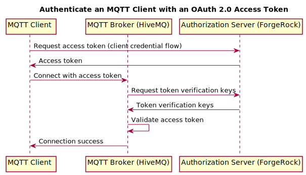

# MQTT Client Authentication with ForgeRock and HiveMQ

The ForgeRock Identity Platform can issue OAuth 2.0 access tokens for authentication and authorization. The HiveMQ
Enterprise Security Extension (ESE) supports JSON Web Tokens (JWT) and allows integration with OAuth 2.0 authorization
servers for client authentication and authorization.

In this example we will show how to use ForgeRock and HiveMQ to authenticate a client as shown in the
diagram below.



## Environment prerequisites

To follow this example you will need the following applications on a Unix-based OS:
- Web browser, Docker, cURL
- [HiveMQ](https://www.hivemq.com/developers/getting-started/) and the [Enterprise Security Extension](https://www.hivemq.com/docs/4.2/enterprise-extensions/ese-getting-started.html)
- The [MQTT CLI](https://hivemq.github.io/mqtt-cli/docs/installation/packages.html)

## ForgeRock Access Management (AM)

You will configure ForgeRock Access Management (AM) as an OAuth 2.0 authorization server. It authenticates the client,
issues access tokens, and validates issued tokens. For more information on using AM with OAuth 2.0, see the
[OAuth 2.0 Guide](https://backstage.forgerock.com/docs/am/6.5/oauth2-guide/).

This example uses AM's public Docker image. To allow the browser access to the AM instance running on
the container you must first map AM's FQDN to your localhost:
```bash
echo 127.0.0.1 openam.example.com >> /etc/hosts
```

Now you can start the AM instance:
```bash
docker run -p 8080:8080 gcr.io/forgerock-io/openam:6.5.2.1
```

Once the container has started, navigate to http://openam.example.com:8080 in your browser. This will take you to the AM
installation page. Select *Create Default Configuration* and accept the license agreement. Enter the administrator
password (we use `password` in this example) and select *Create Configuration*. Once the configuration is complete,
select *Proceed to Login*. Log in using the administrator credentials (User Name: `amadmin`, Password: `password`).

### Configure the OAuth 2.0 Provider

In the *Top Level Realm*, navigate to *Services* and add the *OAuth2 Provider* service. Select *Create*.


On the *Core* settings tab, enable *Use Client-Based Access & Refresh Tokens* and select *Save Changes*. This will
enable the issuing of client-based access tokens, in JWT format. On the *Advanced* tab, change the
*OAuth2 Token Signing Algorithm* to *ES256* and select *Save Changes*. This will ensure that the token is signed with
one of the shared verification keys.


### Configure the OAuth 2.0 Client

Navigate to *Applications > OAuth 2.0* and add a client with the following values:
- Client ID: `mqtt-client`
- Client Secret: `password`
- Default Scope(s): `mqtt`


Go to the *Advanced* tab and in the *Grant Types* fields, add *Client Credential* and select *Save Changes*.


### Retrieve an OAuth 2.0 Access Token

We will use the client credential grant flow to retrieve an OAuth 2.0 access token. Run the following command:
```bash
curl --request POST \
    --data "grant_type=client_credentials" \
    --data "client_id=mqtt-client" \
    --data "client_secret=password" \
    http://openam.example.com:8080/oauth2/access_token
```

The response contains the access token you can use to authenticate the client in later steps:
```json
{
    "access_token":"eyJ0eX...v5vS_w",
    "scope":"mqtt",
    "token_type":"Bearer",
    "expires_in":3599
}
```

Verify that the access token is valid and contains the expected claims:
```bash
curl --request POST \
    --user mqtt-client:password \
    http://openam.example.com:8080/oauth2/introspect?token=eyJ0eX...v5vS_w
```

The response should contain the `scope` claim with a value of `mqtt`:
```json
{
    "active":true,
    "scope":"mqtt",
    "client_id":"mqtt-client",
    "user_id":"mqtt-client",
    "token_type":"Bearer",
    "exp":1580746380,
    "sub":"mqtt-client",
    "iss":"http://openam.example.com:8080/oauth2",
    "auditTrackingId":"c7e64fdf-c513-45d4-a52d-66b8fd243cfa-72229",
    "cts":"OAUTH2_STATELESS_GRANT",
    "expires_in":3600
}
```

## Configure HiveMQ ESE

You need to configure HiveMQ to allow client authentication with OAuth 2.0 access tokens issued by ForgeRock. The ESE will
verify the token signature and validate the *reserved-claims*, in this case the `mqtt` *scope*. See
[Json Web Tokens (JWT)](https://www.hivemq.com/docs/4.2/enterprise-extensions/ese.html#jwt) for more information
about the configuration.

Replace the configuration in *enterprise-security-extension.xml* with the following and restart HiveMQ.
```xml
<?xml version="1.0" encoding="UTF-8" ?>
<enterprise-security-extension
        xmlns:xsi="http://www.w3.org/2001/XMLSchema-instance"
        xsi:noNamespaceSchemaLocation="enterprise-security-extension.xsd"
        version="1">
    <realms>
        <jwt-realm>
            <name>ForgeRock</name>
            <enabled>true</enabled>
            <configuration>
                <jwks-endpoint>http://openam.example.com:8080/oauth2/connect/jwk_uri</jwks-endpoint>
                <introspection-endpoint>http://openam.example.com:8080/oauth2/introspect</introspection-endpoint>
                <simple-auth>
                    <username>mqtt-client</username>
                    <password>password</password>
                </simple-auth>
            </configuration>
        </jwt-realm>
    </realms>
    <pipelines>
        <listener-pipeline name="forgerock-pipeline" listener="ALL">
            <jwt-authentication-manager>
                <realm>ForgeRock</realm>
                <jwt-validation>
                    <reserved-claims>
                        <scope>mqtt</scope>
                    </reserved-claims>
                </jwt-validation>
            </jwt-authentication-manager>
            <allow-all-authorization-manager/>
        </listener-pipeline>
    </pipelines>
</enterprise-security-extension>
```

## Authenticate an MQTT Client

Use the access token retrieved from ForgeRock to authenticate the MQTT client. Run the MQTT CLI in shell mode:
```
mqtt sh
mqtt>
```

Connect with the access token:
```
mqtt> con -i myClient -u mqtt-client -pw eyJ0eX...v5vS_w
myClient@localhost>
```

If the connection fails then the access token might have expired. Request a new token and try again.
Enable [diagnostic mode](https://www.hivemq.com/docs/4.2/hivemq/diagnostics-mode.html) for debug information.

You can see the client status in the [HiveMQ Control Center](https://www.hivemq.com/docs/4.2/control-center/introduction.html)


