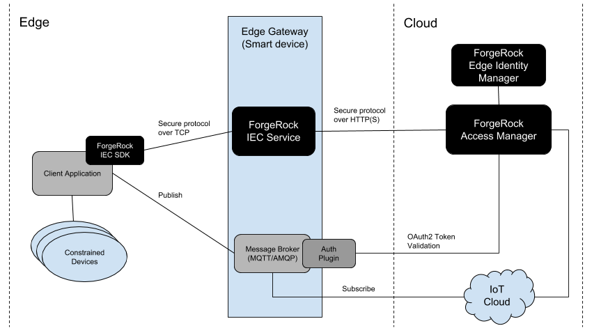

## ForgeRock Identity Edge Controller Introduction

The Identity Edge Controller (IEC) consists of multiple components that together enable devices to securely register as identities in AM. Once registered, the IEC enables a device to:

* Get configuration.
* Request OAuth2 access and ID tokens.
* Allow devices to pair with users using OAuth2 Device Flow.
* Call customisable scripts in AM.

The IEC consists of four components:

* The SDK client library provides a simple C API for client applications to invoke AM functionality via the IEC Service. The SDK library is small and uses a secure lightweight messaging protocol so that it can run on constrained devices.
* The IEC Service runs on a device on the local network, providing secure communications between client applications and AM. Additionally, there is an ARM TrustZone enabled version of the IEC service that provides secure storage on devices that support OP-TEE.
* The Edge AM plugin adds IoT specific functionality to AM. It provides a single secure communication point for the IEC Service and allows the service to perform tasks like registering edge nodes and retrieving OAuth2 tokens.
* The Edge Identity Manager provides a User Interface to AM for viewing and managing device identities.

