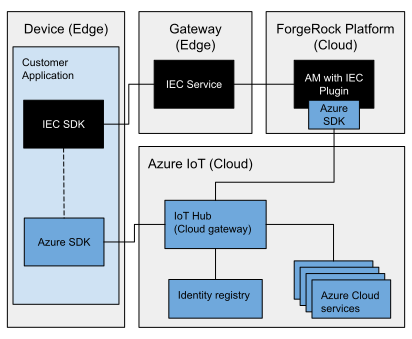

## Azure IoT Integration

### Introduction

The IEC offers just-in-time registration, similar to that of Azure’s provisioning service. However, the IEC uses
JWT Proof of Possession based attestation by default, with configurable registration and authentication chains.
To take advantage of the IEC registration process, the Azure IoT platform can be configured to work alongside the IEC
and delegate device provisioning to the ForgeRock Platform. This integration example demonstrates how a device can be
registered with the ForgeRock Platform and automatically added to the Azure IoT Hub.



Components in the example are:
- Client application
    - registers a device with the ForgeRock platform using the IEC SDK
    - retrieves the device configuration, containing the Azure IoT Hub connection string, using the IEC SDK
    - publishes generated telemetry data to the Azure IoT Hub, using the Azure IoT device client SDK
- IEC Service
    - facilitates registration and configuration requests for the client application
- AM
    - registers edge nodes
    - adds a device to the Azure IoT Hub
    - retrieves the Azure IoT Hub connection string and storing it in the device's configuration
    - supplies device configuration on request

### Prerequisites

- ForgeRock BackStage account with access to AM and the IEC
- [Docker](https://docs.docker.com/install/) and [Docker Compose](https://docs.docker.com/compose/install/)
- ForgeRock IEC Training Environment installed as described in [training](../../training)
- Azure account and a reasonable understanding of the [Azure IoT Hub](https://azure.microsoft.com/en-us/services/iot-hub)

### Prepare Azure IoTHub

- [Create](https://docs.microsoft.com/en-us/azure/iot-hub/quickstart-send-telemetry-java#create-an-iot-hub) an IoT hub

### Prepare the training environment

If the training environment has not already been set up then follow the [instructions](../../training/README.md) and
use the `quick_install` command to prepare the AM and IEC Service containers.

Copy the IEC SDK downloaded for the training environment to `integrations/azureiot/resources`.

From the `integrations/azureiot` directory run `docker-compose up -d --build` to start the container for building
and running the Azure Client.

### Prepare AM

We will use the custom device attestation script in AM to add a device in Azure during device registration in AM. The
device configuration script will be used to retrieve the Azure device connection string.

Copy the contents of the following scripts to AM:
 - `examples/am_scripts/CustomDeviceAttestation.groovy` to
  [Edge Device Custom Attestation](http://am.iec.com:8080/openam/XUI/#realms/%2Fedge/scripts/edit/CustomDeviceAttestation)
 - `examples/am_scripts/GetDeviceConfig.groovy` to
  [Edge Device Configuration Command Handler](http://am.iec.com:8080/openam/XUI/#realms/%2Fedge/scripts/edit/GetDeviceConfig)

To connect to the IoT hub, you need the connection string for the iothubowner shared access policy. From the IoT Hub
page in Azure portal, select `Shared access policies > iothubowner` and copy the `Connection string—primary key`.
Replace the `iotHubConnectionString` in [Edge Device Custom Attestation](http://am.iec.com:8080/openam/XUI/#realms/%2Fedge/scripts/edit/CustomDeviceAttestation)
script with the copied connection string.
 
Add `com.microsoft.azure.sdk.iot.service.*` to the
[Script Engine Configuration](http://am.iec.com:8080/openam/XUI/#configure/globalServices/scripting/contexts/edit/AUTHENTICATION_SERVER_SIDE/engineConfiguration/edit/engineConfiguration)
whitelist.

Build the Azure Service Client SDK and place it on AM's classpath:
```
docker run -v $(pwd)/examples/am_scripts:/root/forgerock/am_script azure-client:latest bash -c "cd /root/forgerock/am_script && mvn clean install"

docker cp examples/am_scripts/target/azure-sdk-libraries-1.0.0-jar-with-dependencies.jar am:/usr/local/tomcat/webapps/openam/WEB-INF/lib
```

Run `restart_tomcat` in the `am` container.

### Build and run the Azure Client

Connect to the Azure Client container by running the following in a new terminal:
```
docker exec -it azure bash
```

Next we have to build the Azure Client and run it to register the client and device. In the Azure container run:
```
build && run
``` 

When the client starts up it will initialise itself, creating a client identity in AM called `azure-client`. It
will register a device with AM called `CityCentre` and AM will add the device to Azure IoT Hub. The client will then
retrieve the the Azure connection string for the device and use it to publish telemetry data to the Azure IoT Hub.

You can subscribe to receive the telemetry data by following the
[Read the telemetry from your hub](https://docs.microsoft.com/en-us/azure/iot-hub/quickstart-send-telemetry-java#read-the-telemetry-from-your-hub)
tutorial from the Azure IoT Hub documentation.

### Cleaning up

Stop the started containers:
 - from the `integrations/azureiot` directory run `docker-compose down`
 - from the `training` directory run `docker-compose down`
 
[Remove](https://docs.microsoft.com/en-us/azure/iot-hub/quickstart-send-telemetry-java#clean-up-resources) the Azure resources