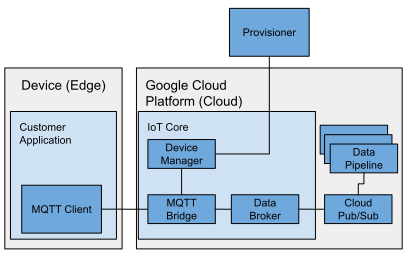
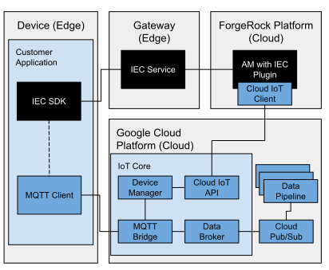

## Google Cloud Platform IoT Integration
### Introduction

The IoT Core component of the Google Cloud Platform (GCP) can ingest data from devices at the edge.
This data can then be funnelled to other GCP components for processing, analysis, visualisation and storage.
In order for a device to connect, it must first be registered with the IoT Core device manager by an authenticated
"provisioner".

The ForgeRock Platform with the IEC offers just-in-time registration with configurable registration and authentication
chains.
Furthermore, the ForgeRock Platform can act as an authenticated GCP IoT Core device provisioner.
This integration example demonstrates how registration with the ForgeRock Platform can be configured to register devices
in GCP IoT Core, thus devices automatically receive "dual-citizenship" of both platforms through the IEC.
The newly registered device can then connect via MQTT to GCP IoT Core and send and receive data.

Components in the example are:
- Client application
    - registers a device using the IEC SDK, passing its public key as registration data
    - obtains MQTT connection information by requesting its configuration from AM using the IEC SDK
    - connects to the GCP MQTT bridge, authenticating itself via a JWT signed with its private key
    - publishes and subscribes to topics via the GCP MQTT bridge
- IEC Service
    - facilitates registration and get configuration requests for the client application
- AM
    - registers edge nodes
    - registers a device with GCP IoT Core
    - stores the relevant GCP IoT Core MQTT connection information as device configuration
    - supplies device configuration on request

### Prerequisites

- ForgeRock BackStage account with access to AM, DS and the IEC
- [Docker](https://docs.docker.com/install/) and [Docker Compose](https://docs.docker.com/compose/install/)
- ForgeRock IEC Training Environment installed as described in [training](../../training)
- GCP Account and a reasonable understanding of the the following:
    - GCP IoT Core - https://cloud.google.com/iot-core/
    - GCP service accounts - https://cloud.google.com/iam/docs/service-accounts

### Prepare Google Cloud Platform

1. Create or use an existing GCP project
1. Enable IoT Core
1. [Create](https://cloud.google.com/iot/docs/how-tos/devices#iot-core-create-registry) a device registry 
1. [Create](https://cloud.google.com/docs/authentication/production) a service account
1. Give the service account the [correct role](https://cloud.google.com/iam/docs/understanding-roles) - cloudiot.provisioner should be sufficient
1. Save service credentials JSON to disk.

### Get certificates and keys
Download the [Google root CA certification package](https://pki.goog/roots.pem) to [examples/resources](examples/resources). 
This ensures that the device can verify the Google IoT Core server certificates.

Generate a P-256 Elliptic Curve key pair for the demo device:

	cd examples/resources
	openssl ecparam -genkey -name prime256v1 -noout -out ec_private.pem
    openssl ec -in ec_private.pem -pubout -out ec_public.pem
    
IoT Core supports the [RSA and Elliptic Curve algorithms](https://cloud.google.com/iot/docs/how-tos/credentials/keys) 
but the code in this demo assumes that the device has a P-256 Elliptic Curve key pair.

### Modify training environment

If not already built, follow the instructions in [training](../../training) to build the training environment and
complete the installation process (see quick_install) for all three containers. Run the modify script:

	./modify-training-environment.sh
	
This script will:
 * add the [Cloud IoT API Client Library for Java](https://developers.google.com/api-client-library/java/apis/cloudiot/v1) 	
to AM in the `am` container [1]
 * add the client example to the `sdk` container

[1] To make a Java class callable from a script, it must be added to the scripting engine whitelist.
In this case, the required classes have already been whitelisted for the [AUTHENTICATION_SERVER_SIDE](http://am.iec.com:8080/openam/XUI/#configure/globalServices/scripting/contexts/edit/AUTHENTICATION_SERVER_SIDE/engineConfiguration/edit/engineConfiguration) in the training environment.
See [script engine security](https://backstage.forgerock.com/docs/am/6.5/dev-guide/#script-engine-security) for more information.

Open the Edge Device Custom Attestation [script](http://am.iec.com:8080/openam/XUI/#realms/%2Fedge/scripts/edit/CustomDeviceAttestation)
and replace the code with the script in [CustomDeviceAttestationGCPDevice.groovy](am/groovy/CustomDeviceAttestationGCPDevice.groovy).

Assign the variables in the `project data` section of the script, based on values used when [preparing GCP](#prepare-google-cloud-platform)
as described in the following table:

| groovy script variable | description |
| --- | --- |
| projectID | ID of GCP project |
| region | Cloud region of IoT Core registry |
| registryID | ID of IoT Core Registry |
| serviceAccountCredentials  | The JSON credentials of the service account [2] |

[2] The JSON credentials requires processing in order to be parsed correctly by groovy.
Run the utility script:

	./process-credentials.sh path/to/credentials.json

Copy the output and paste into the double quotes `"_"`.

### Build and run the example client

Enter the `sdk` container:

    docker exec -it sdk bash

Build the client application:

    cd ~/forgerock/go-examples
    ./build-gcp-mqtt-device.sh

Run the client application:

    ./dist/gcp-device-mqtt --deviceID panther

The client will:
1. register a device (with deviceID) with AM via the IEC. AM will register the device with IoT Core.
1. use the private key of the device to connect a MQTT client to the GCP MQTT bridge
1. publish a message to the device's status topic
1. publish a message to the device's telemetry event topic
1. subscribe to the command topic. 
Commands can be sent to the device by clicking the `SEND COMMAND` button in the registry entry for the device on IoT Core. 
1. subscribe to the config topic.
Configuration can be sent to the device by clicking the `UPDATE CONFIG` button in the registry entry for the device on IoT Core. 
