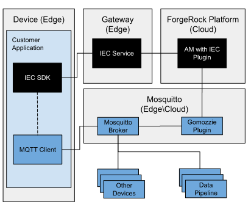

## Mosquitto Integration
### Introduction

[Mosquitto](https://mosquitto.org/) is an open source MQTT broker that can run on the edge or in the cloud.
In addition to its internal authorisation and authentication mechanism,
Mosquitto can be configured to call out to an external library.
This integration uses the [Gomozzie Plugin](https://github.com/LimaEchoCharlie/gomozzie) that enables Mosquitto to
validate OAuth2 access tokens issued by AM.

Components in the example are:
- Client application
    - registers a device using the IEC SDK
    - obtains an OAuth2 access token via the IEC SDK
    - connects to the Mosquitto Broker using an OAuth2 access token as a password
    - publishes and subscribes to topics via the Mosquitto Broker
- IEC Service
    - facilitates registration and get token requests for the client application
- AM
    - registers edge nodes
    - introspects OAuth2 access tokens for the Gomozzie Plugin
- Gomozzie Plugin
    - performs authentication and authorisation for the Mosquitto Broker

#### Gomozzie Plugin

Gomozzie acts as an OAuth2 token validator for the Mosquitto Broker.
A valid token authenticates a device and the scopes of the token are used to authorise a device to publish, subscribe and read.
The following scopes are used by Gomozzie:

- `mqtt:write:{filterA}` will authorise publications to topics that match filterA.
For example, `mqtt:write:#` allows publications to all topics.
- `mqtt:read:{filterB}` will authorise subscriptions to and reads from topics that match filterB.
For example, `mqtt:read:#` allows subscriptions to all topics.

See the MQTT [specification](http://docs.oasis-open.org/mqtt/mqtt/v5.0/cs02/mqtt-v5.0-cs02.html#_Toc514345513) for more
information about topic filters.

Mosquitto has a mechanism to pass configuration from its own config file to a plugin. Gomozzie requires:

- the id and secret of an OAuth2 client that has been created in AM within the same realm as the devices.
- the OAuth2 introspection endpoint of the device realm

See the `auth_opt_openam_` values in the Mosquitto [configuration](./mosquitto/config/mosquitto.conf) for the settings
used for this integration example.

#### Token expiry

The OAuth2 token used by the device will eventually expire and the device will become unauthorised.
There is no method to communicate this expiry to the device from the Auth Plugin and so the MQTT client application must
be responsible for managing this.
For example, in this client [application](../../examples/go/src/forgerock.org/cmd/device-mqtt), the
expiry time of the token is used to trigger a reconnection of the MQTT client.

### Prerequisites

- ForgeRock BackStage account with access to AM and the IEC
- [Docker](https://docs.docker.com/install/) and [Docker Compose](https://docs.docker.com/compose/install/)
- ForgeRock IEC Training Environment installed as described in [training](../../training)

### Build and run the mosquitto container

Build a container that has the Mosquitto server and the AM Mosquitto plugin (gomozzie) installed with all the relevant
configuration for Mosquitto to communicate with the training environment:

	cd mosquitto 	
	docker build -t mosquitto .
	cd -

Run the `mosquitto` container in the background:

	docker run --rm -v $(pwd)/log:/mosquitto/log \
		-p 1883:1883 --network training_iec_net \
		--ip 172.16.0.13 --add-host am.iec.com:172.16.0.10 \
		--name mosquitto -d mosquitto
		
The debug logs for the broker (mosquitto.log) and the plugin (gomozzie.log) will appear in the `mosquitto/log` folder.
Confirm that the server has started correctly:

	cat mosquitto/log/mosquitto.log
	
	1563543348: mosquitto version 1.5.8 starting

### Modify the OAuth2 Client Group

Authentication and authorisation within the Mosquitto plugin is controlled by OAuth 2.0 access token scopes.
To ensure that all devices get this authority by default, modify the `DeviceOAuth2Group` OAuth 2.0 group in AM. 

1. Open the `DeviceOAuth2Group` [editor](http://am.iec.com:8080/openam/XUI/#realms/%2Fedge/applications-oauth2/groups/edit/DeviceOAuth2Group)
in the AM Admin Console.
1. Add `mqtt:write:#` to *Scope(s)* and *Default Scope(s)*.
1. Add `mqtt:read:#` to *Scope(s)* and *Default Scope(s)*.
1. Click *Save Changes*.

### Modify the OAuth2 Service

In order to make a running example client more responsive to OAuth2 client changes, it is recommended that the lifetime
of an access token is decreased for this example.

1. Open the OAuth2 [provider](http://am.iec.com:8080/openam/XUI/#realms/%2Fedge/services/edit/oauth-oidc) 
in the AM Admin Console.
1. Change *Access Token Lifetime (seconds)* to `20`.
1. Click *Save Changes*.
 

### Build and run the example client

Copy the Go client examples into the `sdk` container:

	docker cp ../../examples/go sdk:/root/forgerock/go-examples

Enter the `sdk` container:

    docker exec -it sdk bash

Build the client application:

    cd ~/forgerock/go-examples
    ./build-mqtt-device.sh

Run the client application in publisher mode:

    ./dist/device-mqtt --deviceID wildcat
    
Use the subscriber flag to run in subscriber mode:

    ./dist/device-mqtt --subscribe --deviceID wildcat
    
In both cases a topic name (or topic filter for the subscribe mode) can be supplied via the topic flag.
The default topic is `/devices/{deviceID}`.

This example will:
1. register a device (with deviceID) with AM via the IEC.
1. create a MQTT client that uses the IEC as a credentials provider. 
1. connect the MQTT client to the Mosquitto broker
1. Mosquitto passes the client credentials to the AM auth plugin. 
The plugin will call out to AM to introspect the access token.
If the token is valid and has the correct scopes, the data is cached and the connection is authorised. 
1. in publish mode, the client will publish dummy telemetry every two seconds to the topic.
1. or in subscribe mode, the client will subscribe to the topic and print out any received messages.
1. the client runs a process that reconnects the MQTT client when the access token expires.
Triggering a call out to the IEC to provide new credentials.

### Communicate with the example client

A single `human` user has been added to the internal Mosquitto database to enable communication with the device.

The `human` user can only connect from within the `mosquitto` container:

	docker exec -it mosquitto bash
	
Use mosquitto_sub to listen to a publishing device:	

	mosquitto_sub -p 1884 -u human -P password -t /devices/#

and mosquitto_pub to send a message to a device in subscribe mode:	

	mosquitto_pub -p 1884 -u human -P password -t /devices/wildkat -m hello
