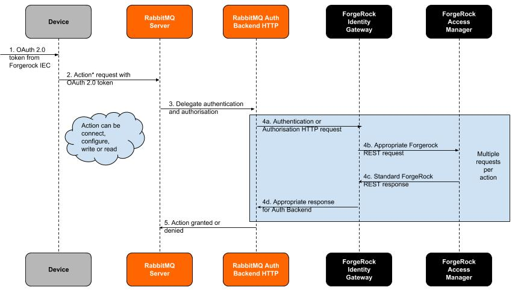

## RabbitMQ Integration
### Introduction

This sample integration shows how [RabbitMQ](http://www.rabbitmq.com) can authenticate a device with AM. The device requests to subscribe to a MQTT topic and presents an OAuth 2.0 access token as its password. The device can securely obtain this token from the Identity Edge Controller. 

The integration consists of five docker containers:
* am, iec, sdk - inherited from the training environment
* rabbitmq - a RabbitMQ docker image containing a vanilla RabbitMQ server with small configuration changes to switch on and configure the [HTTP Auth Backend](https://github.com/rabbitmq/rabbitmq-auth-backend-http) and [MQTT](https://github.com/rabbitmq/rabbitmq-mqtt) plugins, which are both distributed with the RabbitMQ server. 
* ig - [ForgeRock Identity Gateway](https://www.forgerock.com/platform/identity-gateway) (IG) as an intermediary between RabbitMQ and ForgeRock AM. 

The following diagram shows the authorisation flow:



In a production environment, it is recommended to use caching for authentication and authorisation to prevent performance degradation, for example with RabbitMQ [Access Control Cache](https://github.com/rabbitmq/rabbitmq-auth-backend-cache). 

This integration uses an AM rest endpoint to check the validity of the access token and assumes that a valid token grants the device full authorisation. More granular access control can be achieved by modifying IG and AM. Please refer to the [IG documentation](https://backstage.forgerock.com/docs/ig).

### Prepare the environment

Download [Identity Gateway](https://backstage.forgerock.com/downloads/browse/ig/latest) to `ig/resources`.

### Build and Run
In a terminal, navigate to the [training](../../training) directory.
Build and start a modified version of the training environment in the background:

```
docker-compose -f docker-compose.yml -f ../integrations/rabbitmq/docker-compose.rabbitmq.yml up -d --build
```
A RabbitMQ docker image will be downloaded from Docker Hub, the first time that this environment is built.

Follow the [training instructions](../../training/README.md) on how to:

* Install AM
* Install IEC
* Unpack the SDK tarball

The IG and RabbitMQ containers do not require any additional modification, but to check whether they are running, visit the admin consoles:

* [RabbitMQ Management UI](http://localhost:15672/) - use the default user `guest` with password `guest` 
* [IG studio](http://localhost:8088/openig/studio/)

Copy the RabbitMQ subscription example into the SDK container and re-enter the container:

    docker cp ../integrations/rabbitmq/examples/* sdk:/root/forgerock/examples/
    docker exec -it sdk bash
   
Add the lib directory to the PATH:

    export LD_LIBRARY_PATH=~/forgerock/lib
    export DYLD_LIBRARY_PATH=~/forgerock/lib
    
Modify the build script permissions and run to build all the example programs:
    
    chmod +x ~/forgerock/build-examples.sh
    ~/forgerock/build-examples.sh
    
Initialise and run the subscriber program:

    cd ~/forgerock/examples/rabbitmq_mqtt_sub
    ~/forgerock/iecutil --file sdk-config.json --initialise sdk
    ./rabbitmq_mqtt_sub
    
The subscriber will wait for messages on the `chat` topic.
You can send a message to the `chat` topic from outside docker using the `guest` credentials and the curl command:

    curl -X POST \
      http://localhost:15672/api/exchanges/%2f/amq.topic/publish \
      -H 'Authorization: Basic Z3Vlc3Q6Z3Vlc3Q=' \
      -H 'Content-Type: application/json' \
      -H 'cache-control: no-cache' \
      -d '{"properties":{},
     "routing_key":"chat",
     "payload":"Hello from guest",
     "payload_encoding":"string"}'

To pull down the environment, use:

    docker-compose -f docker-compose.yml -f ../integrations/rabbitmq/docker-compose.rabbitmq.yml down
